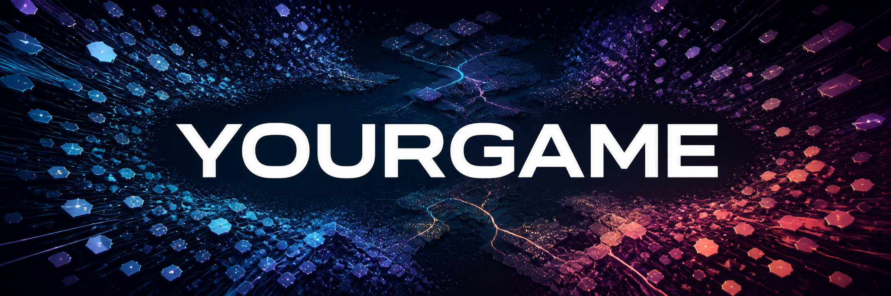

# yourga.me

**집단지성의 산출물이 게임이 된다면 어떨까요?**

[English](README.md) · **한국어**

[yourga.me 방문하기](https://yourga.me/?lang=ko) · [개발 기록](CHANGELOG.md) · [기여 안내](CONTRIBUTING.md)

**MIT 라이선스로 공개하는 집단 게임 창작 오픈소스 실험입니다.** 자유롭게 포크하고 발전시키며 다음 변화를 함께 만들어 주세요. [라이선스](LICENSE) · [게임 버전 보관소](game-archive/)

위키피디아는 사람들이 지식을 모아 무엇을 만들 수 있는지 보여줍니다. **yourga.me는 그 공동의 노력이 게임이 된다면 어떨지 묻습니다.** 여러 사람의 아이디어로 세계를 만들어 가며, 누구도 혼자서는 설계하지 않았을 게임으로 발전시키는 실험입니다.

이 프로젝트는 [Everyone Draw](https://everyonedraw.com/)에서 영감을 얻었습니다. 함께 그림을 그리는 캔버스를 보며, 그 캔버스가 플레이할 수 있는 게임이라면 무엇을 함께 만들 수 있을지 생각했습니다.

yourga.me는 독립적인 실험이며, Everyone Draw 또는 위키피디아와의 제휴나 공식 지원을 의미하지 않습니다.

## 어떻게 참여하나요?

1. **제안합니다.** 캐릭터, 규칙, 사건, 게임 메커니즘, 세계의 변화를 제안합니다.
2. **투표합니다.** 다른 사람의 의견을 읽고 투표하며 게임이 나아갈 방향에 참여합니다.
3. **제작하고 검토합니다.** 승인된 요구사항을 오케스트레이션·시나리오·아트·게임플레이·에셋의 다섯 역할이 처리합니다. 운영자가 안전성, 구현, 플레이 가능 여부를 확인한 뒤 공개합니다.
4. **플레이하고 다시 제안합니다.** 함께 진화하는 솔로 로그라이크를 플레이하고, 달라진 점을 확인하며 다음 변화를 제안합니다.

함께 만든다고 모든 제안이 자동으로 반영되지는 않습니다. 서로 충돌하는 아이디어, 기술적 한계, 콘텐츠 안전성, 게임의 일관성을 함께 고려합니다. 공개 제안은 제품 요구 데이터이며, 명령 실행·비밀정보 접근·게임 공개 권한을 부여하지 않습니다.

## 현재 프로젝트

저장소에는 웹사이트, 서버 API, 게임 런타임과 버전별 게임 데이터, 테스트, 제품 결정 기록, 운영 절차가 포함됩니다.

- **9:16 모바일 로그라이크**와 PC 키보드·모바일 터치 조작.
- **영어 기본, 한국어 지원.** 한국 방문자는 처음에 한국어가 선택될 수 있으며, 직접 선택한 언어를 우선합니다.
- 참여용 Google 로그인, 공개 의견, 투표, 공개 별명 변경, 기여도 리더보드.
- 최근 60분 동안 신규 제안 최대 3개, 제안당 UTF-8 2,000바이트. 수정 가능한 제안의 수정은 신규 접수 횟수를 사용하지 않습니다.
- 버전별 로컬 세이브, 검토를 거치는 게임 공개, 후보 실패 시 마지막 검증 게임 유지.
- 매일 **한국시간 23시 의견 마감·다음 자정 공개 목표**. 검토와 검증을 통과해야 하며, 정시 공개를 보장하는 일정은 아닙니다.
- Teen 수준을 넘지 않는 콘텐츠 기준. **정식 ESRB 등급을 취득했다는 뜻은 아닙니다.**

첫 게임 구현인 `v1-20260901`이 저장소에 포함되어 있습니다. Git에 파일이 있거나 빌드가 성공하거나 카운트다운이 끝났다는 사실만으로 게임 공개를 증명하지 않습니다. 실제 제공 선택과 운영자 검증으로 공개 상태를 판단합니다. 기여도 점수 역시 실제 구현·공개 증거가 필요하며, 리더보드가 있다는 사실만으로 점수 지급을 의미하지 않습니다.

## 로컬 실행

**Node.js 22**와 npm을 사용합니다. 로컬 DB로 시작하고 운영 인증정보를 개발 환경에 복사하지 않습니다.

```sh
git clone https://github.com/hongwoogi/yourgame.git
cd yourgame
npm ci
npm run dev
```

[http://localhost:3000](http://localhost:3000)을 엽니다. 개발 서버는 기본적으로 `.local/development.db`를 사용하며 처음 연결할 때 스키마를 준비합니다. Google 로그인에는 본인의 Google 웹 클라이언트 설정이 필요합니다. `.env.example`을 Git에서 제외된 `.env.local`로 복사하고 필요한 값을 채웁니다. 설정 없이도 화면을 확인할 수 있지만 실제 Google 로그인은 사용할 수 없습니다.

스키마 준비만으로 모든 커뮤니티 정책이 활성화되거나 게임이 공개되지는 않습니다. 새로 내려받은 저장소는 빈 화면 상태나 준비 화면을 표시할 수 있습니다. 명시적인 로컬 설정과 운영 절차는 [첫 공개 실행 절차](docs/launch-runbook.md)를 참고하며, 화면을 미리 보기 위해 운영 명령을 실행하지 않습니다.

```sh
npm run build
npx playwright install chromium
npm run test:ui
```

`npm run build`는 소스 문법, 필수 자산, 번역 키와 백엔드·코어 테스트를 검사합니다. UI 테스트는 Playwright로 PC·모바일 동작을 확인합니다. Google 응답을 대체하므로 **실제 Google 계정 로그인 성공을 검증하지는 않습니다.** 앱 배포 전에는 운영 절차에 따라 새 `git archive`에서 설치·빌드를 수행합니다.

## 저장소 구성

| 경로 | 역할 |
| --- | --- |
| `public/` | 웹사이트, 번역, 격리된 게임 런타임, 검토된 버전별 게임 자산 |
| `api/`, `server/` | HTTP 처리, 인증, 제안, 투표, 공개 제어 |
| `scripts/` | 로컬 개발, 검증, 신뢰된 운영자 도구 |
| `tests/` | 백엔드, 게임 규칙, 보안 경계, 브라우저 회귀 검사 |
| `.codex/agents/` | 게임 제작 다섯 역할의 정의 |
| `docs/` | 제품 결정, 기능 계약, 운영 절차 |
| `CHANGELOG.md` | 영어·한국어 공개 개발 기록 |
| `game-archive/` | 게임 데이터·당시 런타임 소스·무결성 목록을 누적하는 버전별 스냅샷 |
| `.local/` | Git에서 제외되는 로컬 DB, 원본 로그, 비공개 검증 기록 |

현재 구성은 JavaScript 모듈, Vercel 호스팅, Turso 데이터 저장소, Cloudflare에서 관리하는 도메인, 운영자 PC의 Codex 워크플로를 사용합니다. 저장소 공개는 해당 계정이나 운영 데이터에 대한 접근 권한을 제공하지 않습니다.

로컬 예약 작업은 운영자의 PC와 Codex 앱이 켜져 있어야 실행됩니다. 네트워크·앱·사용량 한도로 실행이 늦어질 수 있으며, 검증 실패 시 마지막 검증 게임을 유지합니다.

## 개발 과정을 공개합니다

새로 검토한 게임 버전은 [게임 보관소](game-archive/)에 이전 버전과 함께 누적합니다. 같은 버전을 다른 바이트로 덮어쓰지 못하도록 하고, 빌드는 공개 게임마다 완전하고 일치하는 스냅샷이 있는지 검사합니다. 보관소는 소스를 보존하며 실제 출시 결과는 별도로 검증하고 기록합니다.

의미 있는 변경과 그 이유, 검증 결과, 남은 한계를 두 언어의 [개발 기록](CHANGELOG.md)에 남깁니다. 상세 코드 변경은 Git 이력으로 확인할 수 있습니다. 이후 기여에서도 기록을 갱신하고 두 README의 내용을 맞춥니다.

**공개 개발 기록과 비공개 운영 로그를 구분합니다.** 인증정보, 환경 파일, 쿠키, 토큰, 참여자 기록, 제안 원문 내보내기, DB 사본, 비공개 검토 증거를 Git에 넣지 않습니다. 운영 증거는 Git에서 제외된 `.local/`에 보관합니다. 공개 기록에는 민감정보를 제거한 요약만 남기며, 운영 원본 출력을 이슈나 PR에 붙이지 않습니다.

## 자세한 문서

상세 프로젝트 문서는 현재 대부분 한국어이며, 두 README는 같은 소개와 실행 방법을 제공합니다.

- [설계와 결정 기록](docs/design.md)
- [게임 제작팀 워크플로](docs/game-agent-workflow.md)
- [게임 런타임 계약](docs/game-runtime-contract.md)
- [참여 안전 기준](docs/participation-safety.md)
- [투표·기여도 기준](docs/voting-and-contribution.md)
- [언어 지원 기준](docs/localization.md)
- [첫 공개와 복구 실행 절차](docs/launch-runbook.md)
- [일일 의견 수집과 공개 절차](docs/daily-release-runbook.md)
- [과거 인프라 검증 기록](docs/infrastructure-status.md)

## 라이선스

yourga.me는 [MIT 라이선스](LICENSE)의 오픈소스입니다. 저작권·허가 고지를 유지하면 사용·수정·배포·상업적 이용이 가능합니다. 소프트웨어는 보증 없이 제공됩니다. 외부 의존성에는 각각의 라이선스가 적용됩니다. [MIT 표준 라이선스](https://opensource.org/license/mit)를 참고하세요.
