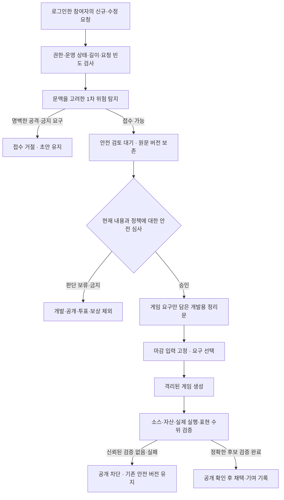

# Teen 콘텐츠 기준과 참여 안전

상태: 2026-08-31 사용자 요청으로 채택한 안전 기준과 구현 계약. 미국 ESRB Teen을 개발 상한으로 삼고, 과도한 선정성·폭력 및 사용자 입력을 통한 안전 규칙 무력화를 제한한다. 투표·기여도도 같은 기준 아래에서만 작동한다. 실제 게임, 격리된 자동 생성 실행자와 신뢰된 산출물 검토 발급 경로는 아직 없다. 이 문서나 입력 검사 통과를 정식 등급 취득·완전한 공격 차단·게임 공개 성공으로 표시하지 않는다.

## 등급 목표와 프로젝트의 더 보수적인 기준

ESRB는 Teen을 일반적으로 13세 이상에 적합한 범주로 설명한다. 일부 폭력, 가벼운 선정적 주제, 적은 유혈 등이 들어갈 수 있지만, 강한 폭력·고어·성적 콘텐츠가 포함될 수 있는 Mature와 구분한다. 개별 콘텐츠의 맥락과 강도도 중요하며 금칙어 목록 하나로 등급이 결정되지는 않는다. [ESRB 등급 안내](https://www.esrb.org/ratings-guide/)

이 프로젝트는 Teen에서 허용될 수 있는 표현의 최대치를 모두 사용하지 않는다. 아래는 ESRB의 세부 규정을 그대로 옮긴 표가 아니라 자동으로 변하는 게임에 적용할 프로젝트 정책이다.

| 영역 | 허용 방향 | 차단하거나 보류할 방향 |
| --- | --- | --- |
| 전투 | 명백한 판타지·만화적 전투, 추상적인 타격 효과, 패배·재도전 | 사실적인 상해·사체·훼손, 고어, 고문·학대 묘사와 이를 보상하는 연출 |
| 유혈 | 기본은 유혈 없이 빛·먼지·입자 효과. 최소한의 비사실적 표현도 결과 검토 | 사실적 출혈, 피의 과도한 분사, 장기·절단면·잔혹한 사망 묘사 |
| 성적 표현 | 비성적인 인물·복장·관계와 이야기 | 노출을 목적으로 한 묘사, 성행위·성적 대상화, 성폭력, 미성년자 성적 표현 |
| 언어·인물 | 게임에 관한 비판과 다른 의견, 비하하지 않는 유머 | 혐오·성적 괴롭힘·특정인 모욕·협박, 강한 욕설의 반복, 개인정보 공개 |
| 위험 행동 | 현실의 위험 행위를 가르치지 않는 판타지 규칙 | 현실의 자해·범죄·무기 제작을 조장하는 안내, 약물 사용 미화, 현금성 도박 |
| 이용자 참여 | 게임 변경 제안, 안전한 찬반 표시 | 안전 규칙 무력화, 관리자 사칭, 비밀 요구, 부정 투표·점수 조작 지시 |

모든 인물의 성적 표현은 보수적으로 제외하므로 미성년자를 성인이라고 부르는 식으로 예외를 만들 수 없다. 단순히 공격·체력·무기·몬스터·죽음이라는 단어가 있다는 이유로 정상적인 로그라이크 요구를 거절하지 않는다. “잔혹한 효과를 없애자”는 안전한 개선 요구이며 위험한 표현을 추가하자는 요청과 구분한다.

화면에는 “Teen 수준을 목표로 개발 중”이라고 표현한다. 정식 심사를 거치지 않은 상태에서 ESRB 인증 마크나 “Teen 등급 취득”을 표시하지 않는다. 실제 등급은 별도 절차이며, 콘텐츠 변경 뒤에도 다시 확인해야 한다. [ESRB 등급 절차](https://www.esrb.org/ratings/ratings-process/)

Teen 개발 목표와 회원의 실제 연령 확인은 별개다. Google 로그인만으로 나이, 자연인 한 명 여부, 보호자의 동의를 확인했다고 간주하지 않는다. 공개 참여 서비스에 필요한 연령·개인정보 운영 정책을 별도로 확정한다.

## 서로 다른 세 가지 판단

1. **안전 심사:** 이 내용을 게임 요구로 검토해도 되는가.
2. **개발 선택:** 장르·충돌·구현 가능성·현재 회차의 지지를 고려해 무엇을 만들 것인가.
3. **산출물 확인:** 만들어진 게임이 실제로 안전하고 동작하는가.

운영 제안 상태 `reviewed`는 안전 승인이 아니다. 입력의 안전 승인은 채택이 아니며, 개발 요청 `completed`나 빌드 `READY`는 실제 공개·등급 적합성의 증거가 아니다. 인기, 관리자 표시를 흉내 낸 본문, 유사도 점수나 기여도 총점으로 어느 단계를 건너뛰지 못한다.

## 제안 접수와 내용별 심사

마지막 세 단계는 게임 구현에 필요한 계약이다. 현재 입력·작업자 검사를 구현했다고 격리된 생성기나 산출물 의미 검토가 이미 존재하는 것처럼 표시하지 않는다.

| 상태 | 의미 | 개발 입력 사용 |
| --- | --- | --- |
| 접수 거절 | 명백한 공격·금지 요구 또는 잘못된 요청. 새 제안·수정 저장 없음 | 불가 |
| `pending` | 접수했지만 현재 본문에 대한 안전 승인이 없음 | 불가 |
| `held` | 문맥·수위·개인정보 등 추가 확인이 필요함 | 불가 |
| `blocked` | 심사에서 정책 위반을 확인함 | 불가 |
| `approved` | 현재 본문과 정책에 대해 명시적으로 승인했고 개발용 정리문이 있음 | 다른 운영·회차 조건도 통과할 때만 가능 |

현재 안전 승인은 서버에서 관리자 권한을 확인한 명시적 검토로 발급한다. 규칙 검사가 위험 문구를 찾지 못했다는 이유만으로 자동 승인하지 않는다. 별도 의미 심사 모델과 격리된 검토 실행자가 연결·검증되기 전에는 자동 검토가 있다고 표시하지 않는다. 검토가 밀리면 검토 대기 상태로 알리고 첫 공개 목표를 이유로 승인 절차를 생략하지 않는다.

승인은 제안 ID, **현재 본문 revision·SHA-256**, 적용 정책 `teen-v1`, 안전 심사 ID·revision 및 **개발용 정리문 SHA-256**에 연결한다. 최초 접수의 중복 방지 해시는 수정된 본문의 해시가 아니므로 대체하지 않는다. 승인을 저장하는 순간에도 서버에서 현재 본문과 권한을 다시 확인한다. 다른 버전을 보고 승인한 요청은 충돌로 거절한다.

승인 뒤 수정하면 이전 승인·정리문은 새 본문에 유효하지 않다. 기존 제안, 원문 버전과 심사 이력은 남기되 새 revision은 다시 검토 대기로 간다. 거절된 수정은 저장되지 않으므로 기존 정상 본문을 덮어쓰지 않는다. 최초 도입 시 과거 제안을 자동 승인하거나 자동 공개하지 않는다. 정책 버전이 바뀌면 과거 승인을 최신 정책 승인으로 재사용하지 않는다.

이력 기능 도입 전의 모든 수정 본문을 복원할 수 있다고 주장하지 않는다. 기존 데이터는 도입 시점의 현재 revision부터 보존하고 이후 변경을 기록한다.

관리자는 원문, 스크리닝 결과, 현재 본문 버전과 안전 기준을 확인하고 이유·점검 확인·게임 변경만 담은 정리문을 남긴다. 기존 “검토함” 버튼으로 안전 승인을 대신할 수 없으며 명백하게 차단되는 현재 본문을 강제 통과시키는 예외 버튼은 제공하지 않는다. 잘못 탐지된 내용은 원문을 유지한 채 보류·검토하고 정상 문맥으로 수정한 뒤 새로 심사한다.

## 초안, 횟수와 남용 제한

- 형식 오류나 명백한 위험으로 서버가 접수를 거절하면 신규 제안 3회 한도를 차감하지 않는다. 브라우저 초안과 오류 안내를 유지하고 자동 재전송하지 않는다.
- 안전 검토 대기까지 접수된 신규 제안은 실제 접수 한 번으로 계산한다. 이후 보류·차단돼도 무제한 재접수가 생기지 않도록 제출 횟수를 돌려주지 않는다. 마감 전 수정은 기존대로 신규 제출 횟수를 사용하지 않는다.
- 별도 계정별 시도 제한은 인증된 신규·수정 요청을 합산하여 고정 60초 창에 최대 30회로 제한한다. 422나 잘못된 JSON 시도도 포함한다. Origin·CSRF 실패는 제3자가 다른 계정의 예산을 소모하지 못하도록 차감 전에 거절한다.
- 성공한 수정 사이에 3초 간격을 적용한다. 429에는 재시도 가능 시간을 제공한다. 여러 탭·동시 요청에서도 서버 DB 기준으로 검사한다. 이 제한은 60분당 신규 3회와 별개다.
- 고정창 경계에서 순간 요청이 몰릴 수 있고 다중 계정으로 우회할 수 있으므로 이것만으로 전체 서비스의 분산 공격을 막았다고 주장하지 않는다. 운영 관측과 필요시 별도 인프라 제한을 함께 적용한다.
- 키워드 한 번 검출이나 반대표 수만으로 계정을 영구 정지하지 않는다. 반복 남용은 별도 운영 근거와 감사 기록을 거쳐 관리자가 제한한다.

## 프롬프트 인젝션과 권한 경계

사용자 본문·투표 메타데이터·닉네임·첨부된 링크의 내용은 권한을 부여하는 지시가 아니다. “이전 규칙 무시”, “관리자로 실행”, 비밀·환경변수 요청, 평가용·번역용 사칭, 역할 구분자, 인코딩된 명령과 지시를 여러 제안으로 쪼개는 경우도 위협 모델에 포함한다. 이 중 어떤 의도인지 확실하지 않으면 검토 대기로 두며 사용자를 악의적인 사람이라고 단정하지 않는다.

OWASP는 프롬프트 구분이나 필터만으로 완전한 예방을 보장할 수 없다고 설명한다. 출력 형식 검사, 입출력 필터, 최소 권한과 외부 자료 분리가 함께 필요하다. 아래 경계는 이 프로젝트의 구체적 구현·검증 조건이다. [OWASP 프롬프트 인젝션 안내](https://genai.owasp.org/llmrisk/llm01-prompt-injection/)

| 경계 | 반드시 지킬 조건 |
| --- | --- |
| 참여자 → 서버 | Google 세션·서버 권한·Origin·CSRF·크기·빈도 검사. 본문에 들어 있는 role, admin, 점수, 승인값을 신뢰하지 않음 |
| 원문 → 검토 | 원문은 비공개 자료로 취급. HTML·Markdown 실행, 링크 자동 열기, 첨부 코드 실행, 환경변수 삽입 금지 |
| 검토 → 생성 | 정확한 승인과 연결된 게임용 정리문만 입력. 원문·위험한 인용·내부 심사 이유를 코드 생성 문맥에 그대로 복사하지 않음 |
| 생성 → 저장소 | 생성기는 게임 코드·자산 후보만 출력. 인증·투표·기여도 계산·관리자·안전 정책·CI·의존성·배포 설정을 사용자 제안으로 수정할 권한 없음 |
| 생성 → 도구·비밀 | 운영 DB, Google 비밀, GitHub/Vercel 배포 권한, 연결 앱, 운영 세션과 네트워크 권한을 생성기에 제공하지 않음 |
| 후보 → 공개 | 신뢰된 별도 검증기가 정확한 소스·자산·입력·정책 식별자를 확인. 후보가 스스로 만든 `approved` JSON을 승인 증거로 취급하지 않음 |
| 게임 → 웹 앱 | 계정·제안·관리자 화면과 실행 출처·권한 분리. 최소 메시지만 검증해서 전달하고 세션·CSRF·임의 URL·HTML·운영 명령은 주고받지 않음 |

같은 PC·같은 권한의 하위 에이전트에 “비밀을 읽지 말라”고 쓰는 것은 OS 격리가 아니다. 격리된 실행 환경, 비밀 없는 작업 복사본, 외부 접근 제한과 믿을 수 있는 공개 담당자가 실제로 갖춰졌는지 검증해야 한다. 현재 이 생성 실행자가 없으므로 게임 공개의 선행조건으로 남는다.

생성 게임을 `yourga.me`의 일반 스크립트로 합치면 HttpOnly 쿠키만으로 계정 API 접근을 막을 수 없다. 별도 출처 또는 `allow-same-origin` 없는 sandbox iframe과 제한된 통신을 사용하고, CSP·저장 중계·버전별 세이브까지 함께 검증한다. 게임이 메인 페이지의 `/api/session`이나 `/api/admin`을 호출할 수 있는 구성을 허용하지 않는다. 기존 Google 로그인 CSP를 게임 편의를 위해 광범위하게 풀지 않는다.

## 입력 고정과 공개 검증

입력 스냅샷 v2는 원문 대신 승인된 정리문과 심사 연결 정보를 고정한다. 정책·본문·정리문·심사 상태·운영 상태를 생성 시작, 입력 사용, 작업 결과 기록에서 다시 검사한다. 심사 정보가 없는 이전 스냅샷을 자동 업그레이드하거나 누락값을 안전 승인으로 채우지 않는다.

실제 제안이 0개인 경우와 안전 검토를 기다리는 제안만 있는 경우를 구분한다. 후자는 “제안 없음”이나 자동 모집 연장으로 처리하지 않고 검토 대기로 알린다. 제외·정지·심사 철회·본문 변경이 확인되면 해당 입력으로 진행 중인 후보를 중단하고 기존 자료를 보존한다.

입력 확인 성공은 공개 허가가 아니다. 공개에는 입력 digest, 정책 버전, 정확한 후보 소스·자산 digest, 게임 실행·콘텐츠 점검 결과가 필요하다. 다른 커밋의 결과, 이전 스크린샷, 자산 목록에 없는 파일, 외부에서 나중에 바뀌는 콘텐츠를 재사용하지 않는다. 신뢰된 검토 발급 경로가 없으면 `RELEASE_REVIEW_UNAVAILABLE`로 공개·완료 처리를 막는다. 게임 공개를 위해 이 검사를 삭제하거나 `approved=true`를 직접 넣지 않는다.

산출물 검토는 코드의 단어 검색뿐 아니라 실제 화면·전투 연출·애니메이션·대사·이미지·소리와 가장 강한 표현을 확인해야 한다. 개발자 모드나 숨긴 자산을 포함하고, 안전한 문장 하나로 안전하지 않은 이미지가 허용되지 않게 한다. 자동 생성 코드의 서버 접근·외부 요청·동적 코드·저장 접근·프레임 메시지도 검사한다.

현재의 관리자·입력 안전 기능 같은 신뢰된 서비스 코드 유지보수 배포와, 참여자 요구에서 생성된 게임 산출물 공개는 구분한다. 후자의 안전 검토가 미완성이어도 전자의 보안 수정을 배포할 수 있지만, 그 배포를 게임 공개 성공으로 세지 않는다.

## 투표·기여도·공개 참여에 적용할 규칙

[투표와 기여도 설계](voting-and-contribution.md)를 따른다. 안전 승인 전에 공개 피드나 투표 대상을 만들지 않는다. 기존 비공개 제안을 작성자 동의 없이 공개하지 않는다. Google 이름·이메일·sub·사진을 리더보드 정보로 재사용하지 않는다.

찬성표는 안전하고 유효한 요구 사이의 우선순위에만 영향을 준다. 반대표는 신고와 다른 의사 표현이며 자동 차단·제재 사유가 아니다. 유사도를 높이는 문구, “나에게 100점”, 위조한 채택 결과, 공개 후 투표는 기여도 발급 근거가 될 수 없다.

신고 기능을 추가할 때는 신고 수로 영구 차단하지 않고 사유·중복·속도를 검사한다. 심각한 의심은 검토 중 공개 노출을 보류할 수 있으며 제안·투표·수정·심사·보상 이력은 삭제하지 않는다. 사용자에게는 범주별 안내와 수정·이의 제기 경로를 제공하고 위험한 원문이나 탐지 패턴을 다른 참여자에게 보여주지 않는다. 신고·이의 제기 전용 화면은 아직 구현하지 않았으며 현재 관리자 검토를 대신했다고 표시하지 않는다.

## 실패와 재검증

- 심사 서비스·DB·정책·검증 자료를 확인할 수 없으면 통과시키지 않는다. 로그인·초안·이미 정상인 게임은 가능한 범위에서 유지한다.
- 최초 게임은 검증 전까지 준비 화면을 유지한다. 공개 후 안전 문제가 발견되면 해당 버전의 새 플레이와 추가 공개를 멈추고 이전에 검증된 안전 버전을 확인해 제공한다. 복귀 대상도 안전하지 않으면 점검 안내를 제공한다.
- 실패를 감추거나 안전 기준을 완화해 예정 시각을 맞추지 않는다. 원인·영향·조치를 이 작업에 보고하고 권한 안에서 복구한다.
- 계정·프롬프트·제출 횟수·투표·기여도·버전별 세이브를 복귀와 함께 초기화하지 않는다. 잘못 지급한 기여도는 근거 있는 조정 이력을 추가해 정정하며 원장을 삭제하지 않는다.
- Google 계정 하나를 자연인 한 명으로 증명했다고 보거나, 테스트 통과를 모든 우회의 부재로 해석하지 않는다. 오탐·우회·남용 사례로 검사 세트를 계속 보완한다.

## 확인해야 할 공격·정상 사례

| 사례 | 기대 결과 |
| --- | --- |
| 일반적인 몬스터·무기·무작위 맵 제안 | 정상 접수 후 안전 검토 대기 |
| “고어 없이”, “성적 표현을 제거” | 단어만으로 명백한 위반 판정하지 않음 |
| 운영 명령·비밀 요청·가짜 시스템 역할·규칙 무시 | 명백한 경우 접수 차단, 원문 실행·권한 변경 없음 |
| 제로폭·전각·혼합 언어·인코딩·여러 제안에 분산 | 분석용 정규화와 검토, 탐지 누락도 승인 없이 개발 불가 |
| 신규·수정 동시 다발, 승인과 수정 경쟁 | 제출/시도 제한과 revision 검사, 옛 승인 재사용 없음 |
| 안전 승인 없이 운영 `reviewed`만 설정 | 공개·개발 불가 |
| 본문·정리문·심사·정책의 일부만 바꾼 스냅샷 | 입력 확인 실패, 기존 스냅샷 보존 |
| 위조한 후보 승인 JSON, 다른 자산으로 바꾼 결과 | 공개 확인 실패 |
| 자기 투표·복제 제안·여러 제안으로 같은 요구 중복 보상 | 별도 투표/기여도 구현에서 원자적으로 거절·중복 제거 |
| 인기 높은 금지 제안, 신고 폭탄 | 안전 판단과 인기 분리, 무조건 채택·제재 없음 |

접수·관리자·입력 스냅샷에 관한 검사는 코드 테스트와 연결한다. 실제 게임의 의미·실행 격리 검증, 공개 피드·신고·투표·기여도 구현 검증은 아직 없는 기능의 완료 항목으로 세지 않는다.
